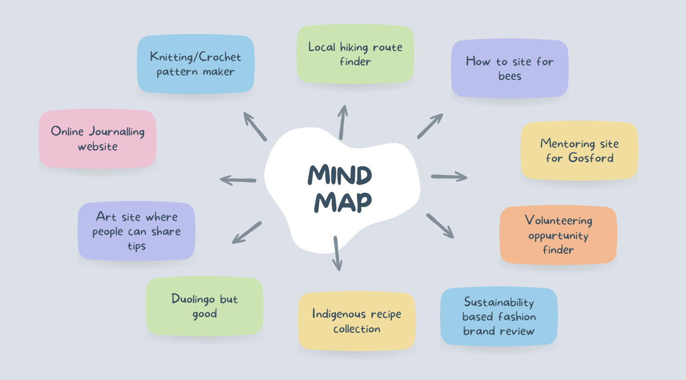
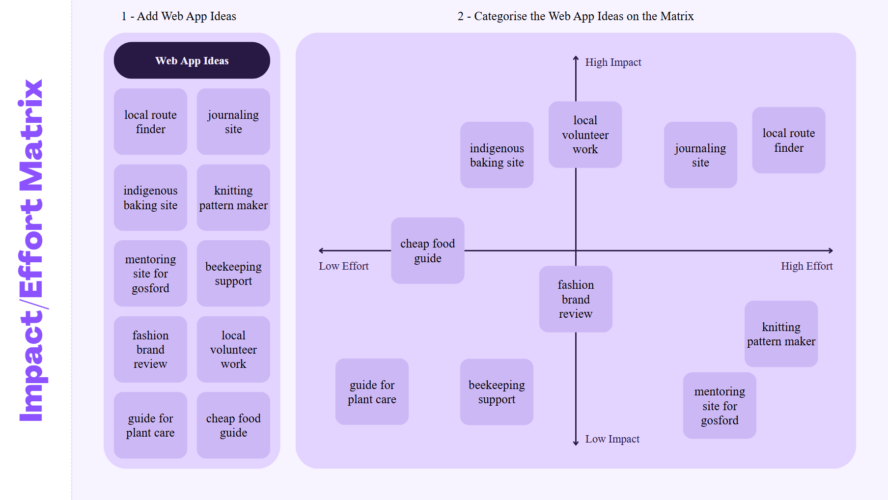
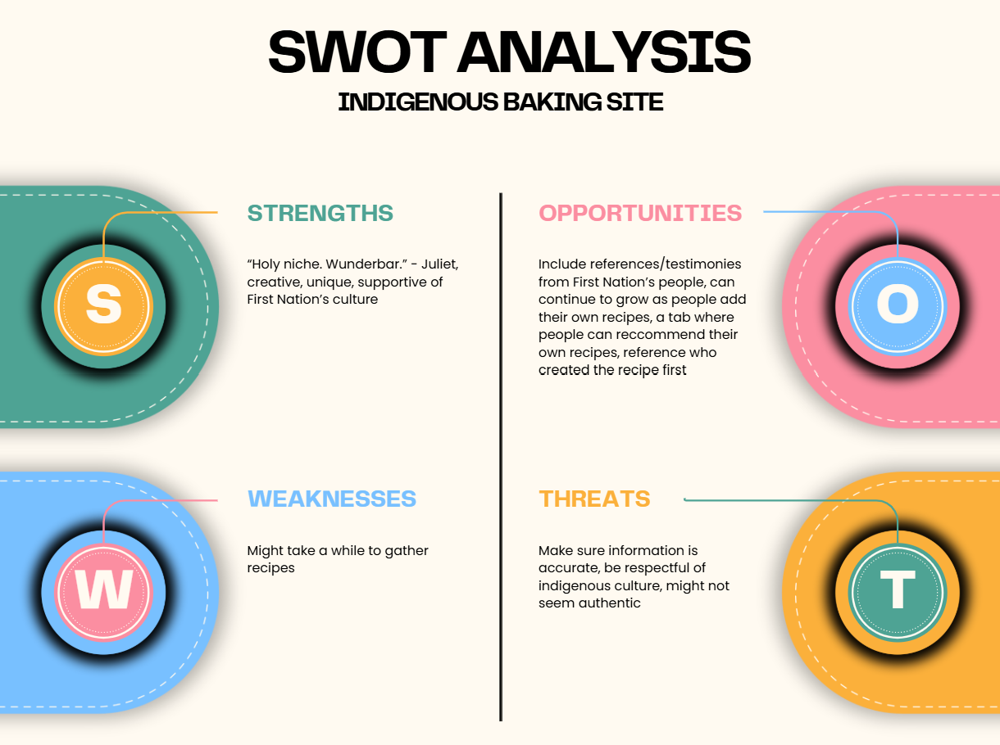
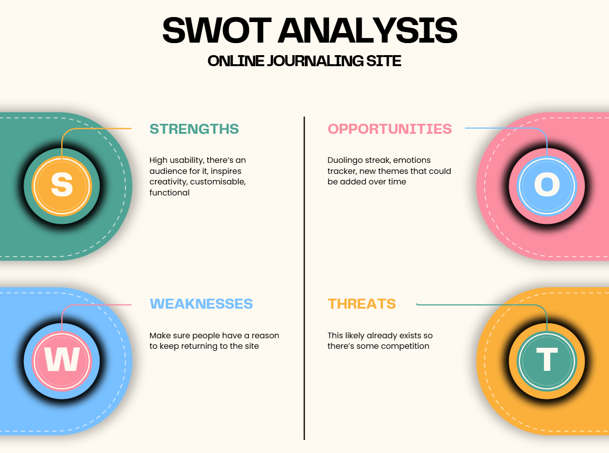

# 10CT Task 2
## Divergent Thinking

| Idea Name | What it does | Influence it explores | Who it Helps |
| --------- | ------------ | --------------------- | ------------ |
| Local Walking/Hiking Route Finder | A map of the trails in your local area with reviews from other people | Physical Activity | People wanting to start walking/hiking |
| Online Journal | A site with a journal you can type in and personalise with daily prompts you can choose to write about | Mental Health | People who lose their journals or want something to write in on the go |
| Indigenous Baking Recipes | A collection of baking recipes using native Australian ingredients | Environmentalism and nutritional health | Australians or bakers |
| Mentoring site for Gosford | Helps connect younger students with seniors offering tutoring | Academic support | Gosford students |
| Beekeeping Support | A collection of articles about beekeeping with an option for you to post questions and have them answered by the community | Helping people start a new hobby | People who want to try beekeeping or need advice |

## Convergent Thinking

### Paragraph
When completing a peer SWOT analysis I found people were very positive towards both an indigenous baking site and an online journaling site, but in general people seem to be more inspired by the Indigenous baking site with many people having ideas for improvements and commonly said it was a unique and interesting way to learn more about First Nation's culture. Additionally my impact/effort matrix the indigenous baking site idea stood out as being fairly low effort while still having a positive impact, while the journaling site was quite high on the effort axis, making me doubt whether I could produce a quality prototype in the time that we have to work on the project. However, many people said that the online journaling site had a high usability, they could see themselves using it in their daily lives, and suggested adding features like a duolingo streak or new themes which could be added over time to differentiate the idea from other online journas already on the market. Overall, although the {bleh} I think the indigenous baking site idea is more suitable for this task due to its high level of impact, achievability, and bla.

## Requirements Outline
### Functional Requirements
- Users will be able to create their own profiles where they can star recipes and leave reviews under recipes
- Users will be able to search through recipes using a variety of filters
- Users will be able to create an account using an email
- Users will be able to log in using a username and password
- The web pages will have a consistent header and navbar

### Non-Functional Requirements
- Navigation between pages will occur in 2 seconds or less
- The website will be able to run on multiple different screen sizes
- User inputs like emails will be [data good yeah yeah]

## Existing Ideas
| Website | Plus | Minus | Implication |
| ------- | ---- | ----- | ----------- |
| Australian Museum | Uses engaging images to create excitement for the exhibits in the user, easy navigation, and colour connotations to make the user want to click on certain things | The layout of the header changes on some of the pages | For my site I can use colour theory to make the user feel inspired and curious, and also visuals to engage the user |
| Uber Eats | Placing an order is simple and efficient, and it’s easy to sort a wide variety of options due to their search filters | Map is annoying to navigate, graphics style changes in some pages | I should have a consistent graphic style across pages and use search filters to allow users to efficiently interact with recipe options |
| Sheep & Stitch | Cute graphics add to the user experience, multimedia elements like videos and pictures of tutorial steps help clarify the knitting process, and the minimalist design enhances usability | Having to scroll up to the top of the website to access the navigation is annoying, it’s hard to get out of the pattern shop once you’re in it, and navigation isn’t the most intuitive | My website could include videos of the recipes being made or simple graphics to help people visualise the method steps |

## Secondary Research
#### Sources
https://pmc.ncbi.nlm.nih.gov/articles/PMC12026976/

https://deadlystory.com/page/culture/Life_Lore/Food

#### Paragraph
A pre-colonial indigenous diet would include a range of meats like sea creatures, reptiles, and birds, fruits, nuts, and vegetables that were farmed using an agroforestry approach like yams, grains, and grasses. Indigenous people used technologies like dam irrigation and food preservation boxes that could be made out of clay and straw or other materials in order to sustainably feed their communities year round. Native ingredients also played a role in medicine such as Goat’s Foot or Ipomoea pes-caprae which was used as an analgesic by mobs from northern Australia and parts of NSW. Although Australian landscapes and typical diets have changed drastically due to the introduction of foreign animals like sheep, research from the International Journal of Environmental Research and Public Health suggests that integrating native ingredients into the diets of everyday Australians can increase awareness of traditional food practices, food security, and improve nutritional health. However, it also reveals that many people feel barriers to eating native produce due to a lack of affordability, knowledge, convenience, or availability, while there is also a risk of not respecting the vast history and culture these ingredients have attached to them. Therefore, my project could focus on incorporating traditional ingredients into modern recipes in order to make them more approachable to people who aren't familiar with native ingredients, however it will be equally important to centre Indigenous Australian culture so that 

## Primary research
