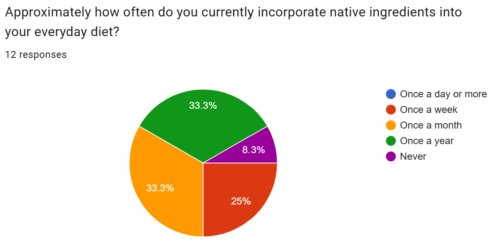
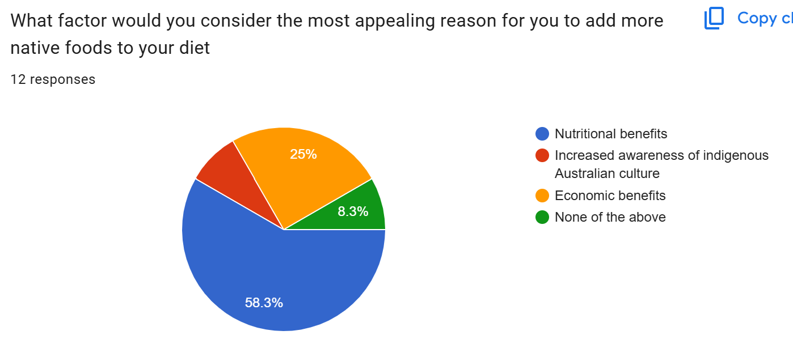
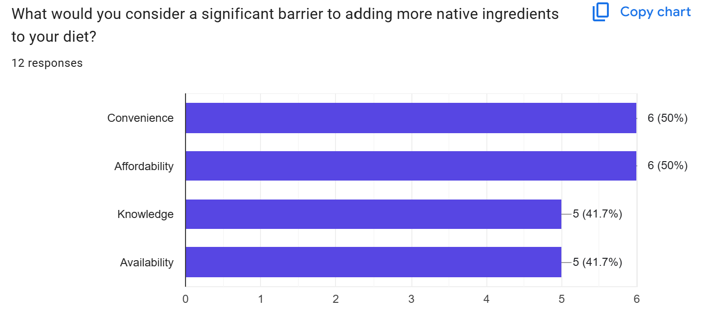
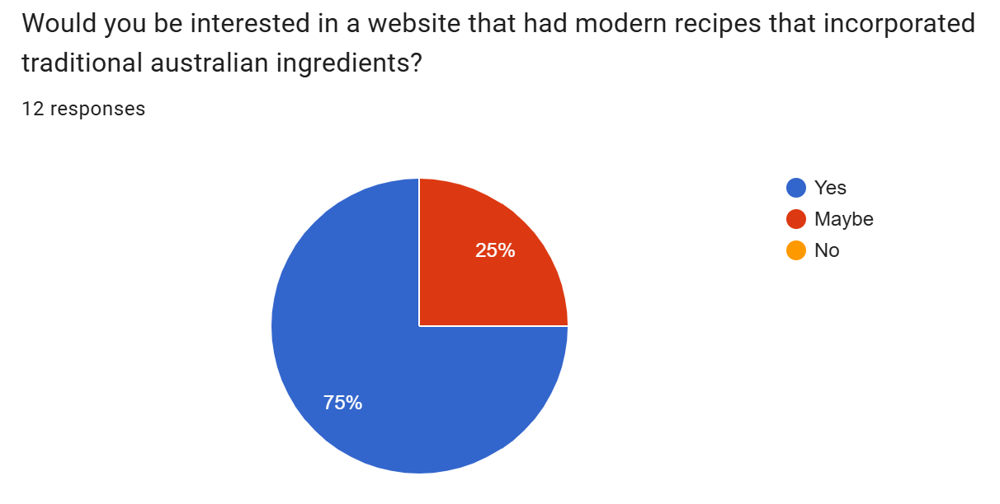
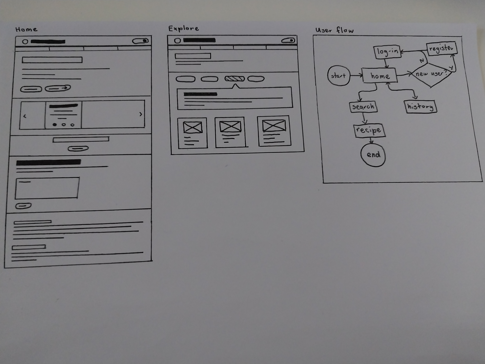

# 10CT Task 2
## Divergent Thinking

| Idea Name | What it does | Influence it explores | Who it Helps |
| --------- | ------------ | --------------------- | ------------ |
| Local Walking/Hiking Route Finder | A map of the trails in your local area with reviews from other people | Physical Activity | People wanting to start walking/hiking |
| Online Journal | A site with a journal you can type in and personalise with daily prompts you can choose to write about | Mental Health | People who lose their journals or want something to write in on the go |
| Indigenous Baking Recipes | A collection of baking recipes using native Australian ingredients | Environmentalism and nutritional health | Australians or bakers |
| Mentoring site for Gosford | Helps connect younger students with seniors offering tutoring | Academic support | Gosford students |
| Beekeeping Support | A collection of articles about beekeeping with an option for you to post questions and have them answered by the community | Helping people start a new hobby | People who want to try beekeeping or need advice |

## Convergent Thinking

### SWOT Evaluation
When completing a peer SWOT analysis I found people were very positive towards both an indigenous baking site and an online journaling site, but in general people seem to be more inspired by the Indigenous baking site with many people having ideas for improvements and commonly said it was a unique and interesting way to learn more about First Nation's culture. Additionally my impact/effort matrix the indigenous baking site idea stood out as being fairly low effort while still having a positive impact, while the journaling site was quite high on the effort axis, making me doubt whether I could produce a quality prototype in the time that we have to work on the project. However, many people said that the online journaling site had a high usability, they could see themselves using it in their daily lives, and suggested adding features like a duolingo streak or new themes which could be added over time to differentiate the idea from other online journas already on the market. Overall, although the {bleh} I think the indigenous baking site idea is more suitable for this task due to its high level of impact and achievability.

## Requirements Outline
### Functional Requirements
- Users will be able to create their own profiles where they can leave reviews and star their favourite recipes to easily find them later
- Users will be able to search through recipes using filters for efficient navigation
- Users will be able to create an account using an email
- Users will be able to log in using a username and password
- The web pages will have a consistent header and navbar to make the design consistent and optimise the user experience

### Non-Functional Requirements
- Navigation between pages will occur in 2 seconds or less
- The website will be able to run on multiple different screen sizes
- User inputs like emails will be handled ethically using best practice

## Existing Ideas
| Website | Plus | Minus | Implication |
| ------- | ---- | ----- | ----------- |
| Australian Museum | Uses engaging images to create excitement for the exhibits in the user, easy navigation, and colour connotations to make the user want to click on certain things | The layout of the header changes on some of the pages | For my site I can use colour theory to make the user feel inspired and curious, and also visuals to engage the user |
| Uber Eats | Placing an order is simple and efficient, and it’s easy to sort a wide variety of options due to their search filters | Map is annoying to navigate, graphics style changes in some pages | I should have a consistent graphic style across pages and use search filters to allow users to efficiently interact with recipe options |
| Sheep & Stitch | Cute graphics add to the user experience, multimedia elements like videos and pictures of tutorial steps help clarify the knitting process, and the minimalist design enhances usability | Having to scroll up to the top of the website to access the navigation is annoying, it’s hard to get out of the pattern shop once you’re in it, and navigation isn’t the most intuitive | My website could include videos of the recipes being made or simple graphics to help people visualise the method steps |

## Secondary Research
#### Sources
https://pmc.ncbi.nlm.nih.gov/articles/PMC12026976/

https://www.aihw.gov.au/reports/diet

#### Secondary Research Paragraph
The majority Australians suffer from a lack of fruits and vegetables in their diets, leading to poor health outcomes and research suggests many would benefit from the addition of vitamin packed native produce. However, it is also necessary to consider the barriers and risks of increasing our consumption of these foods.

Currently, 94% of adults in Australia don't meet their daily reccommended serve of vegetables while 56% don't get their daily reccommended serve of fruit. As a result, dietary factors are now the third leading preventable cause of diease, contributing towards 50% of coronary heart diseases. Notably, this isn't just due to the actions of individuals but a reflection of food accessibility and the nutritional context in which people are raised.

Research from the International Journal of Environmental Research and Public Health suggests that integrating native ingredients into the diets of everyday Australians can increase awareness of traditional food practices, food security, and improve nutritional health. However, it also reveals that many people feel barriers to eating native produce due to a lack of affordability, knowledge, convenience, or availability, while there is also a risk of not respecting the vast history and culture these ingredients have attached to them. Therefore, my project could focus on incorporating traditional ingredients into modern recipes in order to make them more approachable to people who aren't familiar with native ingredients. However it will be equally important to draw attention to the traditional uses of these products by First Nation's people.

## Primary research
### Survey Data

### Interview Summary
- Current cost of living makes me reluctant to try new ingredients in case I'm not able to make something good
- I don't really know where to find native ingredients and I don't know if they'd be ethically sourced
- I'm interested in the new flavours native ingredients could add
- I'd like more information about how to use them in my everyday bakes
- A recipe website would be helpful because I'd like to know that the end product will taste good

### Primary Research Evaluation
When conducting my primary research I found that the majority of responders incorporated native ingredients into their diet either once a month or once a year. However 58.3% said they were interested in the nutritional benefits of native produce, with my interviewee saying "I'd definitely be interested in native fruits with vitamin D." Therefore, informing users about the nutrient properties should be a priority. This could be achieved though a pop-up on the search page once you click on an ingredient or a dedicated page the user can look though.

Additionally, the significant barriers people saw were fairly spread out but convenience and affordability lead by a slight margin. During the interview my respondent also cited a correlation between affordability and knowledge, explaining, "I wouldn't have an issue with the price of [native ingredients] if I knew how to turn them into something people would eat. Right now, especially with how expensive everything is I'm not really confident in that." Because of this, to have the broadest impact in my website I'll focus on combatting affordability and knowledge issues by letting the user filter recipes by ingredient. This means that if the people buy items they don't know what to do with, they can easily navigate to a reliable recipe using that ingredient.

## Wireframes

## Figma Prototype
https://www.figma.com/design/i5ylzBLJjTB3Hj1IVKdWDs/10CT?node-id=0-1&p=f&t=BapLIEHzumKIE98Z-0

## Project Evaluation
Throughout my web design project I encountered a number of issues and was forced to re-evaluate my design, sacrificing some aspects of my initial success criteria. In spite of this I was still able to deliver a final product with high usability and impact on my target market.

I believe I effectively met my functional requirements, but was not able to meet all of my non-functional requirements. Despite overhauling most aspects of the design when I realised that adding a searchbar and having each of the recipes stay within the site with comments at the bottom was going to be unachievable, by relying on the search filters I had planned I was still able to deliver a final product that allowed for user profiles, comments, search filters, and a consistent heading. However, during the design process non-functional requirements like the reliability of the site across different screen sizes was not a key consideration. Currently, the site should be usable on a few different sizes of monitor due to my use of flex boxes but would not be suitable for a mobile. Therefore, although my page navigation and data handling met the criteria, my total completion of the non-functional requirements was limited.

My management of this project was adequate but could be improved upon. Firstly, my original idea was too optimistic and once I realised that it would not be achievable in the time frame I was forced to discard two weeks of work which I could have used spent working on my css styling or upgrading the user profile page. Instead, I ended up doing a majority of the css and html two days before the project was due. In the future, to improve my time management I should be more realistic and consider the time frame I have to do the task in. However since I was also able to adapt my idea and ultimately complete the project I still think my management was sufficient.

Finally, although my final product differs wildly from what I had originally invisioned I still believe my recipe site addresses the needs of Australian bakers interested in native ingredients, albeit slightly less effectively. In the current design users aren't immediately able to use a search bar to find their desired recipe and there are no nutritional infrographics, but the substitution of the ingredient filters still allows them to navigate through the recipe catalogue. Additionally, forcing the user to go to a different site for the recipe instructions might not be the most pleasant user experience it still performs the same function and allows the user to access a diverse range of recipes which utilise native produce. 

Overall, my project successfully met the needs of my target market, but lacked proper time management and reliability.

## Social, Ethical, and Legal Evaluation
1. Social - I believe that I responsibly handled my social considerations to a fairly high extent. My final design prioritised acknowledgement of Indigenous Australian culture through the 'history' tab which allows users to learn about First Nation's dietary traditions. In addition, I believe that my website could attract attention to the nutritional benefits of native produce and encourage people to spend their time productively baking. On the other hand, I had originally wanted to include an acknowledgement of country. Therefore, there is a risk that First Nation's people might feel excluded or disrespected by my site.

2. Ethical - My site is ethically dubious, but within the scope of the project I think I handled my ethical responsibilities fairly well. If I were to release this as a real site I would want to consult with Indigenous Australians and add an information tab on how to ethically source ingredients so that I didn't accidentally encourage users to buy from businesses which undermine First Nation's traditions. However, given that this is just a prototype I believe that this acceptable. My project also collects user emails without giving the user the option to delete or change their email and does not inform them what this will be used for.

3. Legal - In my web app I handled legal issues responsibly and would be able to launch the finished product. My project uses other people's recipes but since in the final project the user is being directed to the original site this does not count as using more than 10% of an original work. In addition if, in the future, I did end up including the recipes in my site recipes do not fall under copyright protection anyway, but I would have to rename the recipes and not use different photos and step-by-step images to the original author.